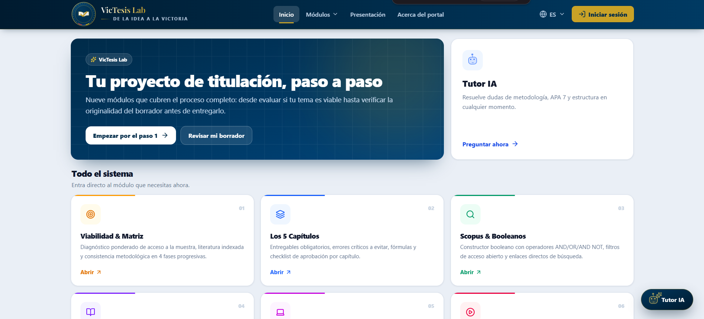
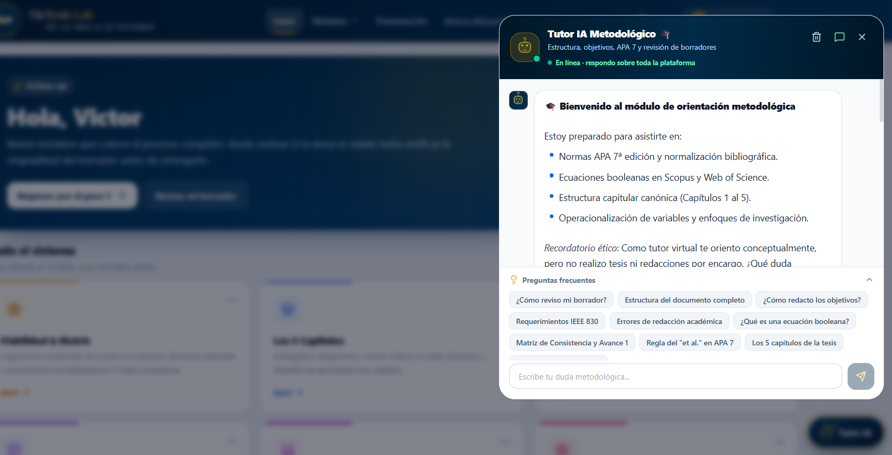
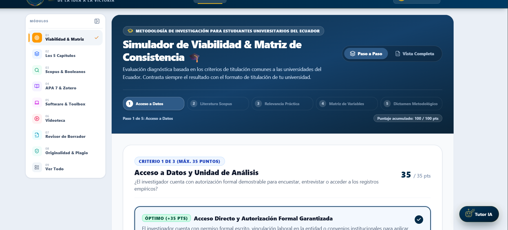
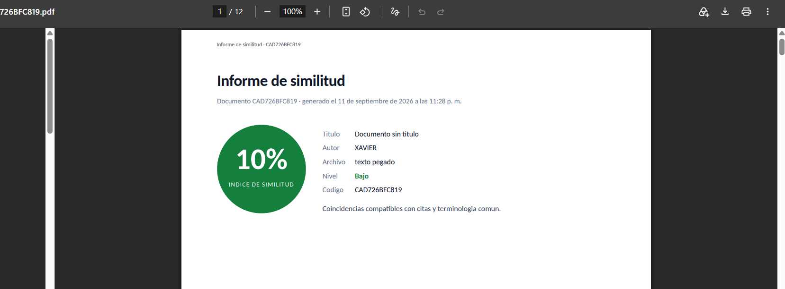
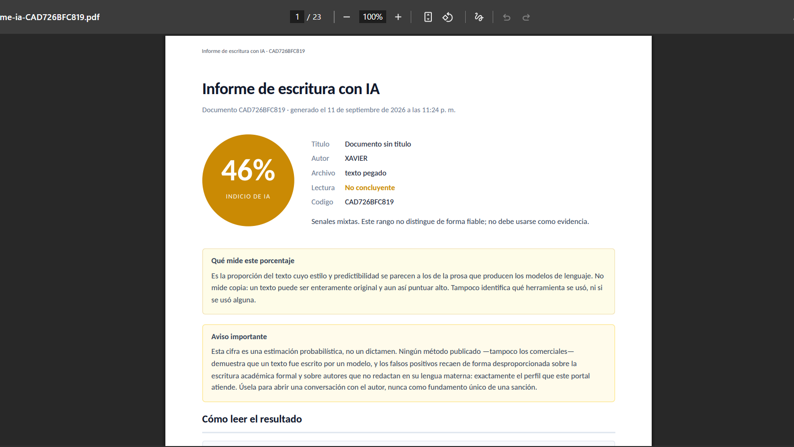

<!--
  Tesis Ecuador · Portal Universitario
  --------------------------------------------------------------------------
  El logo es un SVG independiente (docs/logo-tesis-ecuador.svg) con la
  animación embebida del emblema real de la app (aro dorado que gira,
  destello en el anillo y marca de verificación que se dibuja al cargar).
  Se referencia como imagen  para que GitHub la sirva sin tocar y la
  animación se ejecute en el navegador.
-->
<div align="center">


# VicTesis Lab — Portal Tesis Ec.

**Plataforma web interactiva de apoyo metodológico para estudiantes universitarios de todo el Ecuador en proceso de titulación.**

*De la idea a la victoria* — de la **viabilidad del tema** a la **defensa**: metodología cuantitativa, matriz de consistencia, ecuaciones Scopus, normas APA 7, verificación de originalidad y un **Tutor IA con IA real** que entiende lenguaje natural y conoce el sistema completo.

[](https://react.dev)
[](https://www.typescriptlang.org)
[](https://tailwindcss.com)
[](https://vitejs.dev)
[](https://expressjs.com)

[](https://github.com/Vm199524/PORTAL-TESIS-ECUADOR)
[]()
[](LICENSE)

[](https://portaltesis.web.app)

</div>

---

## 🖼️ Capturas

<div align="center">





</div>

---

## 🗂️ Módulos

| # | Módulo | Qué hace |
|---|--------|----------|
| 01 | **Viabilidad & Matriz** | Diagnóstico ponderado del tema y construcción de la **matriz de consistencia** en 4 fases. |
| 02 | **Los 5 Capítulos** | Entregables, errores críticos y *checklist* por capítulo. |
| 03 | **Scopus & Booleanos** | Constructor de **ecuaciones booleanas** con sintaxis `TITLE-ABS-KEY`. |
| 04 | **APA 7 & Zotero** | Simulador de citas parentéticas, narrativas, en bloque y regla del *et al.* |
| 05 | **Software & Toolbox** | Herramientas de búsqueda, gestión bibliográfica y análisis estadístico. |
| 06 | **Videoteca** | Rutas de video curadas por etapa del proceso. |
| 07 | **Revisor de Borrador** | Diagnóstico automatizado del Avance 1 o 2 (estructura, objetivos, requerimientos, citación, redacción y formato). |
| 08 | **Verificador de Originalidad** | Servicio dedicado de detección de **plagio** y de **contenido generado por IA** en el documento de tesis, con reporte descargable. |
| 09 | **Ver Todo** | Los módulos desplegados en un lienzo continuo. |

Suma también un **Tutor IA** que responde en lenguaje natural sobre metodología y conoce todo el sistema.

---

## 🤖 Tutor IA: un mini-agente con IA real

El Tutor IA combina un **motor determinista offline** (siempre disponible, sin red) con un
**LLM real** que responde en lenguaje natural sobre metodología y sobre **todos los módulos
del sistema**:

1. **Cortesías y flujo guiado** — saludos, agradecimientos y el avance paso a paso del plan de titulación
   (cuantitativo → objetivos → variables → matriz → ecuaciones Scopus → Zotero → APA 7 → redacción →
   originalidad → revisión → estructura → defensa) se resuelven al instante por el motor de intención
   (`src/domain/tutorIntentEngine.ts`), **sin llamar a ninguna API**.
2. **Temas curados** — 20+ temas de metodología (`matchTopicKey`) desde una base de conocimiento
   **localizada a `es · en · pt · fr · it`**.
3. **IA real (mini-agente)** — cuando la consulta es libre, `/api/ask-tutor` compone un **prompt de
   sistema tipo mini-agente con codificación avanzada**: la persona del tutor (**VicTesis Lab**, el portal
   Tesis Ecuador), la regla de marca, el historial de la conversación, el **conocimiento íntegro del
   sistema** (`PLATFORM_MODULES_SUMMARY`, los módulos y qué hace cada uno) y el **idioma activo** del
   chat. Ese esquema —darle al modelo el mapa completo del sistema antes de responder— es lo que hace
   que conteste **magistral, en contexto y rápido**, aunque el LLM no haya sido entrenado con esta app.
4. **Modelo** — primero **Together AI · `meta-llama/Llama-3.3-70B-Instruct-Turbo`** (`TOGETHER_API_KEY`,
   serverless y económica); si no hay clave, intenta Gemini (`GEMINI_API_KEY`); en último término cae al
   motor determinista local. El tutor **nunca queda mudo**.

La primera capa (cortesías, temas curados y flujo) funciona **sin red ni clave**; la capa de IA real se
activa con `TOGETHER_API_KEY`.

---

## 🔒 Revisor de Borrador: privacidad

El documento del estudiante **se procesa íntegramente en el navegador**: la extracción de texto de `.docx` se hace con `DecompressionStream` nativo y el análisis corre en el cliente. No hay subida a servidor ni almacenamiento remoto; el borrador solo vive en `localStorage`.

> El diagnóstico es **orientativo**: evalúa forma y estructura, no el fondo científico. La decisión de aprobación corresponde únicamente al docente o tutor.

---

## 🧰 Stack tecnológico

- **Frontend:** React 19 · TypeScript · Vite 6 · Tailwind CSS v4 (plugin oficial) · Motion · lucide-react.
- **Backend:** Express 4 + `tsx` en desarrollo; **un solo proceso Node** sirve estáticos y API en producción (`dist/server.cjs`).
- **IA:** **Together AI · Llama 3.3 70B** para el texto libre del Tutor IA, con respaldo Gemini (`@google/genai`); detección ONNX (transformers.js) en el servicio de originalidad.
- **i18n:** sistema propio liviano **sin dependencias** (`t()`/`tf()`) con **5 idiomas** — sin i18next, sin peso extra en el bundle.
- **Marca:** paleta `#002B49` (azul marino) y `#c9a227` (dorado).

---

## 📁 Estructura del proyecto

```text
Plataforma_Tesis/
├─ src/
│  ├─ components/        # UI: Tutor IA, matriz de consistencia, Scopus, APA 7…
│  ├─ domain/            # Motor de intención del Tutor, analizador de borradores,
│  │                     # extractor .docx, motor de citas APA, generador Scopus
│  ├─ data/              # Contenido metodológico, catálogo de herramientas y videoteca
│  ├─ i18n/              # Traducciones (es/en/pt/fr/it) + contenido de la KB del tutor
│  ├─ context/           # Preferencias (idioma, tema), auth
│  ├─ App.tsx · main.tsx
│  └─ types.ts           # Contratos compartidos
├─ services/
│  └─ originality/       # Verificador de originalidad/IA (servicio aparte, ONNX)
├─ server.ts             # API Express + /api/ask-tutor (Gemini)
├─ index.html            # Favicon SVG de marca + metadatos OG
└─ vite.config.ts
```

---

## 🚀 Requisitos e instalación

**Requisitos:** Node.js ≥ 20 y npm.

```bash
# 1) Clona el repositorio
git clone https://github.com/Vm199524/PORTAL-TESIS-ECUADOR.git
cd PORTAL-TESIS-ECUADOR

# 2) Instala dependencias
npm install

# 3) Configura el entorno (opcional para desarrollo del tutor)
cp .env.example .env

# 4) Desarrollo: servidor Express + Vite con HMR
npm run dev

# 5) Producción
npm run build     # dist/ (estático) + dist/server.cjs
npm start         # un solo proceso sirve la app y la API
```

La app queda en **http://127.0.0.1:3000**.

> **Nota sobre `localhost`.** El servidor escucha en IPv4 (`0.0.0.0`). Algunos navegadores en Windows
> resuelven `localhost` primero a IPv6 (`::1`) y muestran conexión rechazada. Usa `127.0.0.1` o cambia
> de puerto: `PORT=4321 npm run dev`.

### Variables de entorno

| Variable | Requerida | Descripción |
|---|---|---|
| `TOGETHER_API_KEY` | No | Tutor IA con IA real: Llama 3.3 70B (Together AI). Es la vía prioritaria para el texto libre. |
| `GEMINI_API_KEY` | No | Respaldo del Tutor IA si no hay clave Together (Gemini). |
| `PORT` | No | Puerto del servidor. Por defecto `3000`. |
| `AUTH_SECRET` | Sí (prod.) | Firma de cookies de sesión. |
| `ADMIN_KEY` | No | Clave del panel de guía de corrección (`/#admin`). |
| `GOOGLE_CLIENT_ID/SECRET`, `GITHUB_CLIENT_ID/SECRET` | No | Inicio de sesión social (OAuth). |
| `VITE_ADSENSE_CLIENT`, `VITE_ADSENSE_SLOT_HOME` | No | Google AdSense (sin ellas no se carga publicidad). |
| `ORIGINALITY_API_URL` | No | URL del servicio de verificación de originalidad. |
| `VITE_ORIGINALITY_API_URL` | Solo build prod. | URL pública del Cloud Run del portal para el módulo de originalidad (ver nota en ☁️ Despliegue). |

### Scripts

| Script | Acción |
|--------|--------|
| `npm run dev` | Servidor Express + Vite en desarrollo con HMR. |
| `npm run build` | Compila el frontend a `dist/` y empaqueta el servidor en `dist/server.cjs`. |
| `npm start` | Ejecuta el servidor compilado (`node dist/server.cjs`). |
| `npm run lint` | Verificación de tipos con `tsc --noEmit`. |

---

## ☁️ Despliegue

El `build` produce **estáticos + una API Express** para correr como un único contenedor/servicio Node.

**Cloud Run / Fly.io / Railway (servicio Node)**
```dockerfile
FROM node:20-slim AS build
WORKDIR /app
COPY package*.json ./
RUN npm ci
COPY . .
RUN npm run build

FROM node:20-slim
WORKDIR /app
ENV NODE_ENV=production
COPY --from=build /app/dist ./dist
COPY --from=build /app/package*.json ./
RUN npm ci --omit=dev
EXPOSE 3000
CMD ["node", "dist/server.cjs"]
```

**Firebase Hosting + Cloud Run** — Hosting publica `dist/` como sitio estático y **reenvía `/api/**` a la API Express que corre en Cloud Run** (misma imagen de arriba). Así el portal queda en `https://…web.app` y la API en el mismo origen.

El **servicio de originalidad** se despliega aparte como su propio servicio Cloud Run (tiene su `Dockerfile` en `services/originality`) y el portal lo alcanza con `ORIGINALITY_API_URL`.

> **⚠️ Límite de 60 s del hosting y análisis largos.** Firebase Hosting corta sus
> *rewrites* a Cloud Run a los **60 s** (no configurable), y un análisis de una tesis
> completa dura varios minutos: por el hosting, el navegador recibe un 502/504 de la
> pasarela aunque el detector haya terminado. Por eso el build de producción define
> `VITE_ORIGINALITY_API_URL` con la URL pública del Cloud Run del portal (timeout
> 900 s): el módulo de plagio habla **directo** con ese Cloud Run —CORS habilitado
> para `*.web.app`/`*.firebaseapp.com` y localhost— y se salta el tope del hosting.
> En desarrollo (sin esa variable) se usa el mismo origen y todo sigue como antes.

### Despliegue rápido (`deploy.sh`)

Para iterar sin recompilar en cada push, usa el guión de la raíz:

```bash
bash deploy.sh hosting    # cambio SOLO de interfaz → Firebase Hosting (no toca Cloud Run)
bash deploy.sh portal     # cambió el servidor del portal (server.ts / proxies) → Cloud Run
bash deploy.sh detector   # cambió services/originality → Cloud Run
bash deploy.sh all
bash deploy.sh status     # revisiones y URLs actuales
```

Compila la imagen **una vez** (Docker local si está activo, con caché incremental; si
no, Cloud Build remoto), la sube a Artifact Registry con etiqueta de fecha y despliega
por referencia `--image`. Así un deploy idéntico repetido es casi instantáneo y los
cambios de interfaz nunca reconstruyen los contenedores. Las variables de entorno y
límites de cada servicio se conservan (viven en el servicio, no en la imagen).

---

## 📄 Licencia

Distribuido bajo licencia [MIT](LICENSE). Puedes usar, modificar y reutilizar el código citando la autoría original.

---

<div align="center">

**VicTesis Lab · Portal Tesis Ec.** — *de la idea a la victoria*: recursos, tutoría y formación académica para la titulación.

<sub>Proyecto académico · **Victor Manuel LLuilema Pisco** · Universidad Estatal de Milagro (UNEMI)</sub>

</div>
